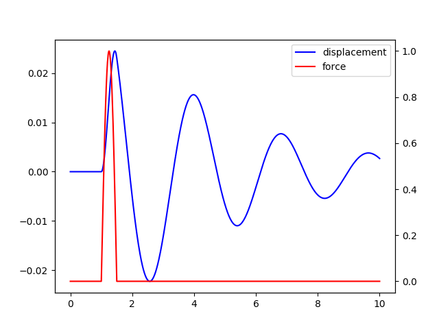

# Vibrations


The system is described by:

mu'' + cu' + ku = F

[Deduction of numerical method](https://ritchievink.com/blog/2017/04/13/writing-a-fourth-order-runga-kutta-solver-for-a-vibrations-problem-in-python-part-1/)

## Solvers

```python
"""
Forcing function acting on the system.

Short pulse.
"""
from ode.vibration import runga_kutta_vibrations

n = 1000
t = np.linspace(0, 10, n)
force = np.zeros(n)

for i in range(100, 150):
    a = np.pi / 50 * (i - 100)
    force[i] = np.sin(a)

# Parameters of the mass spring system
m = 10
k = 50
c = 5

u, v = runga_kutta_vibrations(t, 0, 0, m, c, k, force)

# Plot the result
fig, ax1 = plt.subplots()
l1 = ax1.plot(t, v, color='b', label="displacement")
ax2 = ax1.twinx()
l2 = ax2.plot(t, force, color='r', label="force")

lines = l1 + l2
plt.legend(lines, [l.get_label() for l in lines])
plt.show()
```
