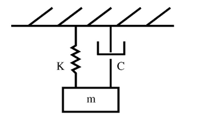

# Vibrations

# Work in progress...



The system is described by:

mu'' + cu' + ku = F

[Deduction of numerical method](https://ritchievink.com/blog/2017/04/13/writing-a-fourth-order-runga-kutta-solver-for-a-vibrations-problem-in-python-part-1/)

## Installation

`$ pip install git+https://github.com/ritchie46/vibrations.git`

## Solvers

Available:
    ode.vibration.runga_kutta_vibrations
    ode.vibration.par

```python
"""
Forcing function acting on the system.

Short pulse.
"""
from vibrations.ode.vibration import runga_kutta_vibrations

n = 1000
t = np.linspace(0, 10, n)
force = np.zeros(n)

for i in range(100, 150):
    a = np.pi / 50 * (i - 100)
    force[i] = np.sin(a)

# Parameters of the mass spring system
m = 10
k = 50
c = 5

u, v = runga_kutta_vibrations(t, 0, 0, m, c, k, force)

# Plot the result
fig, ax1 = plt.subplots()
l1 = ax1.plot(t, v, color='b', label="displacement")
ax2 = ax1.twinx()
l2 = ax2.plot(t, force, color='r', label="force")

lines = l1 + l2
plt.legend(lines, [l.get_label() for l in lines])
plt.show()
```


## Signal

### Fourier Transform

```python
import matplotlib.pyplot as plt
from vibrations.signals import fft

# Time signal of 10 seconds.
t = np.linspace(0, 10, 1800)

# A signal of two sine waves
force = np.sin(50 * 2 * np.pi * t) + 0.5 * np.sin(80 * 2 * np.pi * t)

frequency, ampl = fft(force, t)
plt.plot(frequency, ampl)
plt.show()
```


Validate the if the value N is large for creating a spectrum of 10 seconds and showing a max frequency of 80 Hz.

```python
from vibrations.signals import det_frequency_range_fft

print(det_frequency_range_fft(10, 80)

>>> 1600
```
This means that for N < 1600 the output of the FFT will not be correctly plotted.